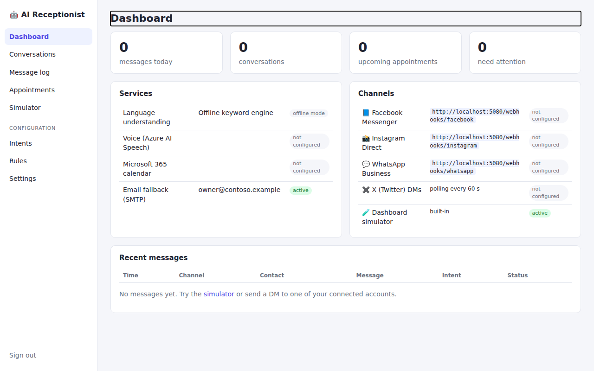
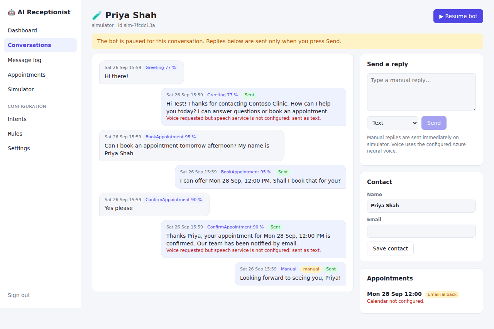
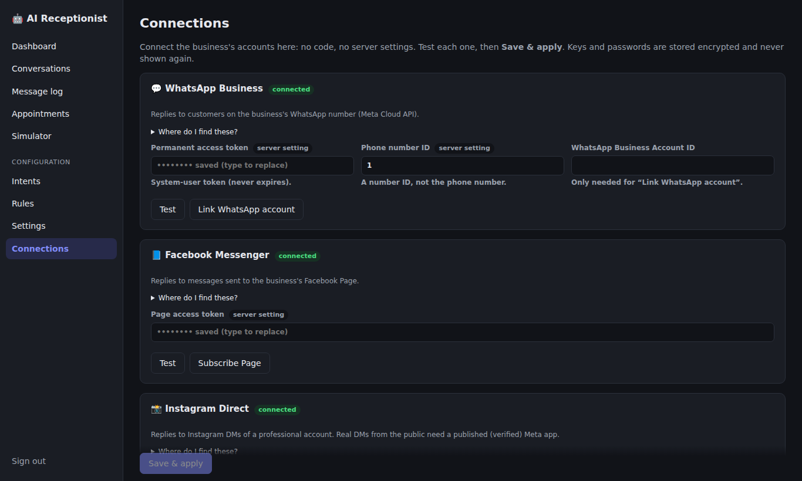
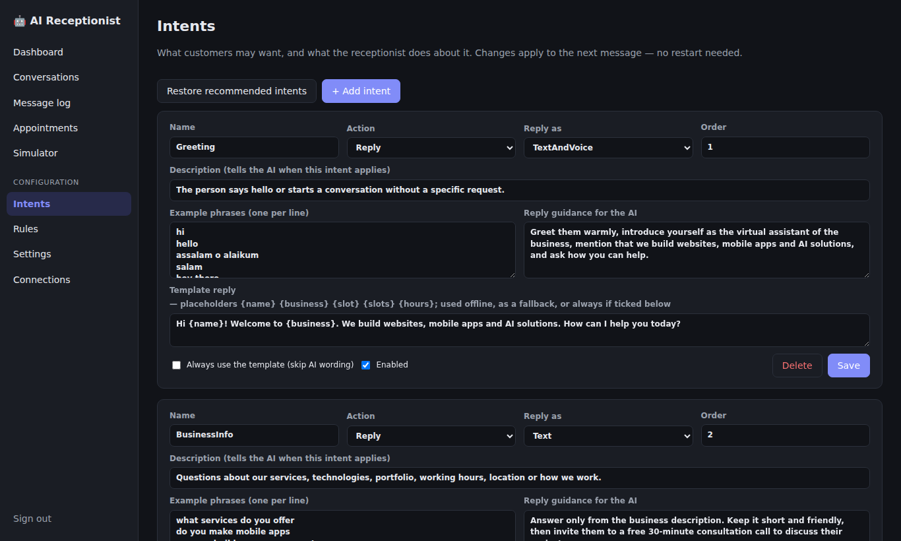
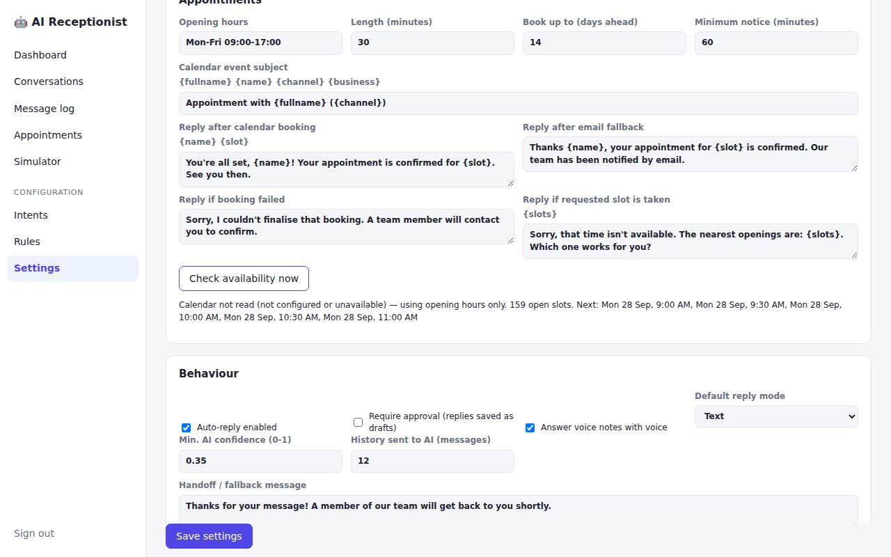
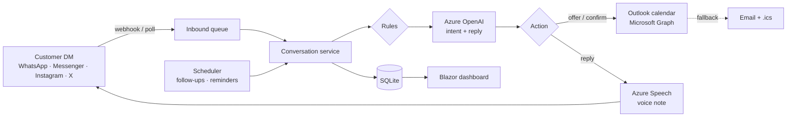

# AI Receptionist

[](https://github.com/dheerajkumar47/AI-receptionist/actions/workflows/deploy-azure.yml)


[](LICENSE)

An AI receptionist for small businesses that answers **WhatsApp, Facebook Messenger, Instagram and X** direct messages
around the clock. It understands what the customer wants, replies in text or a natural **voice note**, books appointments
straight into **Outlook / Microsoft 365**, emails the customer a confirmation, follows up when they go quiet and reminds
them before the meeting. The owner watches and steers everything from a web dashboard, without touching code.



## Features

| Area | What it does |
|---|---|
| **Social inboxes** | WhatsApp Cloud API, Messenger and Instagram via signed webhooks; X DMs by polling. New channels plug in through one interface. |
| **Understanding** | Azure OpenAI (JSON mode) picks one of the business's own intents, drafts the reply and extracts the time, name and email. An offline keyword engine takes over when no AI key is set. |
| **Voice** | Azure AI Speech neural voices: native voice notes on WhatsApp (OGG/Opus), audio on Messenger and Instagram. Inbound voice notes are transcribed on every channel (Urdu/English auto-detect supported). |
| **Booking** | Offers real free slots (opening hours + Outlook free/busy + existing bookings), books only after the customer confirms, and re-checks the slot first. Falls back to email with an `.ics` file if the calendar is down. |
| **Customer emails** | Clean confirmation and cancellation emails with calendar files; no internal notes are ever sent to the customer. |
| **Follow-ups & reminders** | "Let me check and confirm" gets a polite reply and two follow-ups inside Meta's 24-hour window; a reminder goes out 15 minutes before each appointment. |
| **Dashboard** | Live message log, conversation view with audio, manual replies (text or voice), human takeover, approval mode, appointments, a customer simulator, and editors for intents, rules and settings. |
| **Connections** | Clients connect and **test** WhatsApp, Messenger, Instagram, Outlook, email and AI from the dashboard; values are stored encrypted. |
| **Operations** | Every push to `main` is formatted, tested and deployed to Azure App Service by GitHub Actions. The SQLite database upgrades itself on start-up. |

## Screenshots

| Conversation with intent, confidence and booking | Connections: link accounts without code |
|---|---|
|  |  |
| **Intents editable without code** | **Follow-ups and reminders** |
|  |  |

## How it works



Details, design decisions and how to add a channel: **[docs/ARCHITECTURE.md](docs/ARCHITECTURE.md)**.

## Tech stack

C# · .NET 10 (LTS) · ASP.NET Core minimal APIs · Blazor Server · EF Core + SQLite · Azure OpenAI · Azure AI Speech ·
Microsoft Graph · MSAL · MailKit · Meta Graph API · xUnit · GitHub Actions · Azure App Service (Linux)

## Quick start (offline, about 2 minutes)

Requirements: [.NET 10 SDK](https://dotnet.microsoft.com/download/dotnet/10.0) and Visual Studio 2026, VS Code with C# Dev Kit, or Rider.

```bash
git clone https://github.com/dheerajkumar47/AI-receptionist.git
cd AI-receptionist
dotnet user-secrets set "Admin:Password" "choose-a-password" --project src/AiReceptionist.Web
dotnet run --project src/AiReceptionist.Web --launch-profile AiReceptionist.Web
```

Open https://localhost:5001, sign in as `admin`, go to **Simulator** and try *"Hi, can I book a call tomorrow afternoon?"*
followed by *"yes please"*. Without keys the app runs in offline mode (keyword engine, text replies). Add services one at a
time on the **Connections** page or as described in **[docs/SETUP.md](docs/SETUP.md)**.

## Deploy

Create a Linux Web App (.NET 10) on Azure, add the repository variable `AZURE_WEBAPP_NAME` and the secret
`AZURE_WEBAPP_PUBLISH_PROFILE`, and run the **Deploy to Azure** workflow. Data is kept in `/home/data` across deployments.
Full steps: [docs/SETUP.md §9](docs/SETUP.md#9-deploy-to-azure-app-service).

## Documentation

| Guide | For |
|---|---|
| [SETUP.md](docs/SETUP.md) | Azure OpenAI, Speech, Outlook, email, Meta (WhatsApp, Messenger, Instagram), X, webhooks and Azure deployment |
| [CLIENT-ONBOARDING.md](docs/CLIENT-ONBOARDING.md) | Setting it up for a client: discovery survey, account access, runbook, customer journey, handover |
| [ARCHITECTURE.md](docs/ARCHITECTURE.md) | Message flow, design decisions, adding channels, scaling out |
| [ACCEPTANCE-TEST.md](docs/ACCEPTANCE-TEST.md) | Pre-flight checklist, 15-minute acceptance script and demo shot list |

## Project layout

```
AiReceptionist.sln
├─ src/AiReceptionist.Core            Domain, EF Core, conversation orchestrator, rules, scheduling,
│                                     booking + email fallback, follow-ups and reminders, offline engine
├─ src/AiReceptionist.Infrastructure  Azure OpenAI, Azure Speech, Microsoft Graph calendar, SMTP,
│                                     Meta / X / Twilio channel connectors, dependency injection
├─ src/AiReceptionist.Web             Host, webhook endpoints, background workers, Blazor dashboard,
│                                     Connections page and encrypted settings store
├─ tests/AiReceptionist.Tests         xUnit: booking flows, fallbacks, follow-ups, reminders, rules,
│                                     parsers, signatures, schema upgrades, end-to-end webhook tests
└─ .github/workflows                  Format check, tests and deployment to Azure App Service
```

```bash
dotnet test                          # run all tests
dotnet format --verify-no-changes    # check formatting (also enforced in CI)
```

## Known limitations

- **Meta approval.** While the Meta app is unpublished, only people with a role on it (and up to 5 WhatsApp test numbers)
  can use the bot. Instagram DMs from the public, and Messenger for everyone, need business verification and App Review.
- **24-hour window.** WhatsApp, Messenger and Instagram only allow free-form messages within 24 hours of the customer's last
  message; later reminders use Messenger's event-update tag, an approved WhatsApp template, or email.
- **X DMs** require a paid X API plan and are polled every 60 seconds.
- **Scale.** One instance with SQLite and an in-memory queue suits a single business per deployment. See ARCHITECTURE.md
  for scaling out.

## License

Released under the [MIT License](LICENSE). You may use, modify and distribute it, keeping the copyright notice.

---

Built by [Dheeraj Kumar](https://github.com/dheerajkumar47) · Dheeraj Software Solutions
